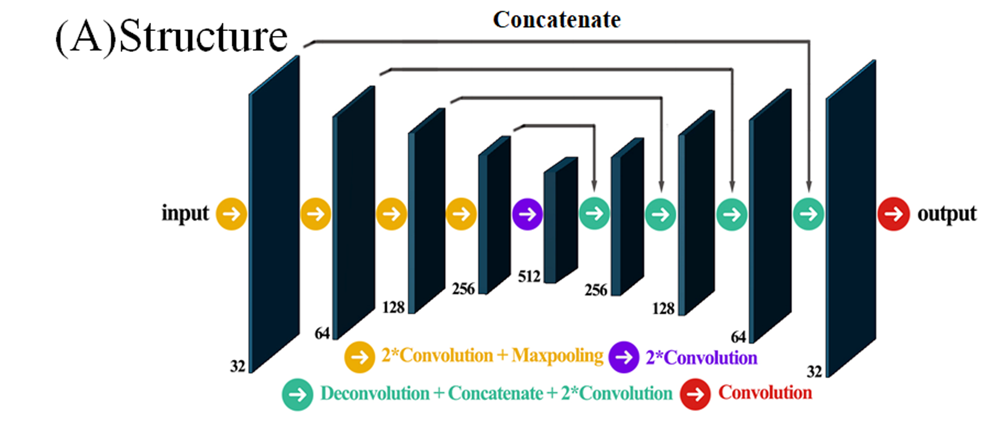
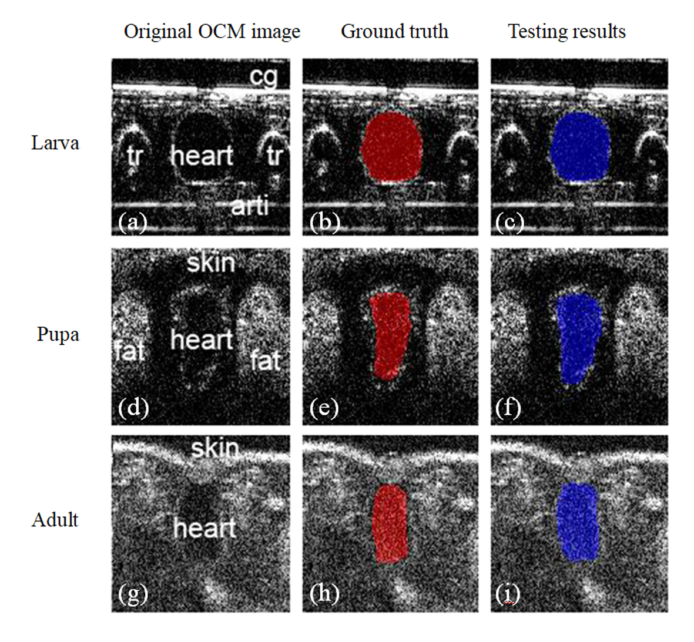

# FlyNet -- A Deep Learning Model for Semantic Segmentation

This work is an implementation on the paper Segmentation of Drosophila Heart in Optical Coherence Microscopy Images Using Convolutional Neural Networks, which can be found [here](https://github.com/Nogimon/FlyNet/blob/master/Segmentation%20of%20Drosophila%20Heart%20in%20Optical%20Coherence%20Microscopy%20Images%20Using%20Convolutional%20Neural%20Networks.pdf), or at (https://arxiv.org/abs/1803.01947).

## Code
The model is written in Keras based on Tensorflow. 

Basic packages (i.e. numpy, glob) is required. Some image processing package (cv2, skimage etc) is also required.

## Network Structure
The network structure is shown below

It consists of 5 convolutional groups and 4 transpose convolutional groups, with skip connections, to generate the final output.

## Result
The result of the model is a segmentation mask, indicating the pixels of the fly heart area.

